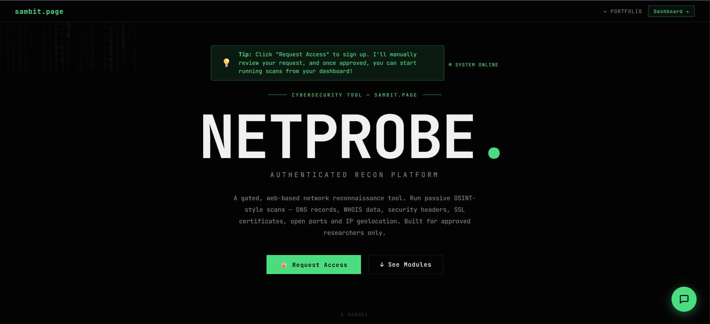
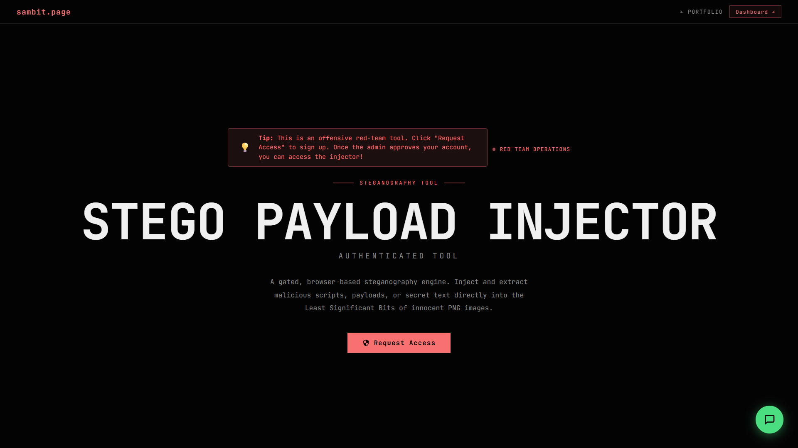
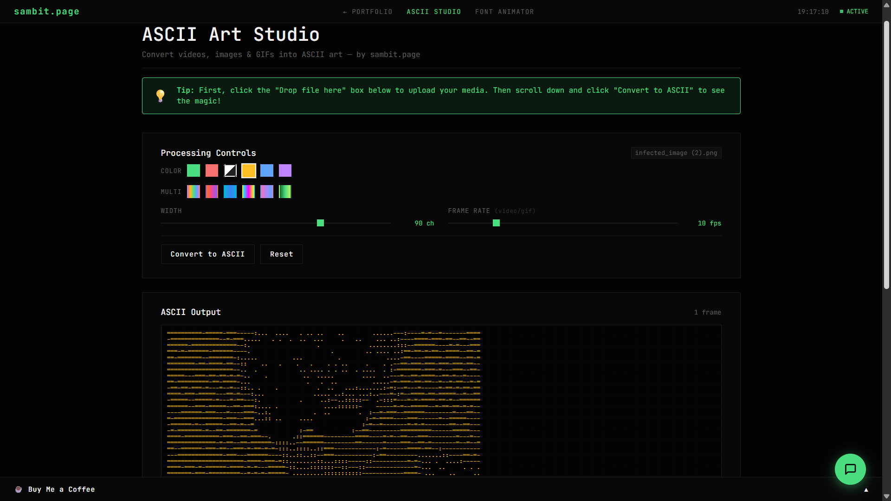
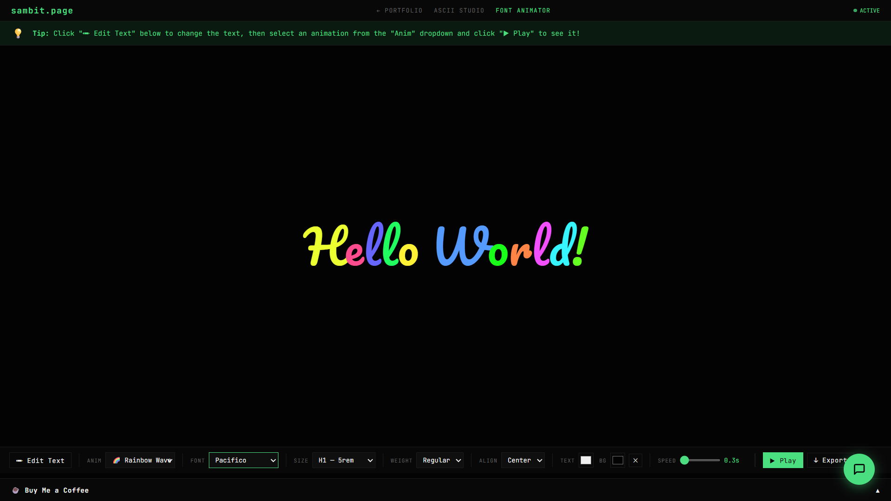
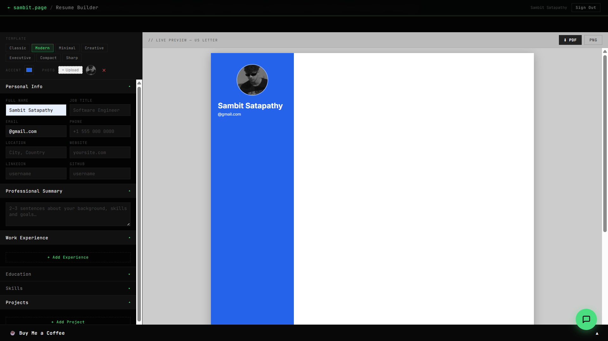

# Sambit Satapathy - Cybersecurity Portfolio & Web Tools

A cyberpunk/terminal-themed personal portfolio and collection of free web tools created by Sambit Satapathy. Built entirely with Vanilla HTML, CSS, and JavaScript (no frameworks) to ensure maximum performance and a deeply customized aesthetic.

## 🌐 Live Website
**[sambit.page](https://sambit.page)**

---

## 🛠️ Included Web Tools

### 1. NetProbe
An authenticated network reconnaissance platform designed for cybersecurity analysis.
- **Features:** DNS enumeration, WHOIS lookups, security header scanning, SSL info, IP geolocation, and Shodan open port scanning.
- **Usage:** Requires manual approval/login via Firebase Auth. Once logged in, enter a target domain or IP address to gather comprehensive OSINT and vulnerability data.
- **Screenshot:**
  

### 2. Stego Payload Injector
A client-side steganography engine that allows users to securely hide messages or payloads within images.
- **Features:** Injects malicious scripts or covert messages into the Least Significant Bits (LSB) of PNG images without visual distortion.
- **Usage:** Upload a cover image, enter your secret payload or text, and click inject to download the modified image. To decode, upload the stego-image and click extract.
- **Screenshot:**
  

### 3. ASCII Art Studio
A browser-based creative tool that converts videos, images, and animated GIFs into customizable ASCII art.
- **Features:** Supports 6 different color palettes, custom frame rates, and variable output resolutions. Works entirely client-side for privacy.
- **Usage:** Upload any image or video file. Adjust the character density and palette settings in real-time, then copy the result or save it.
- **Screenshot:**
  

### 4. Font Animator
A live text animation studio for creating dynamic CSS text effects without writing code.
- **Features:** Choose from various Google fonts, sizes, colors, and preset CSS animation styles. Export the final result as raw HTML, CSS, or JSON with a single click.
- **Usage:** Type your text, customize the styling and animation properties using the control panel, and click "Export Code" to use it in your own projects.
- **Screenshot:**
  

### 5. Resume Builder
A free online resume maker featuring a sleek, professional interface.
- **Features:** 3 professional templates (Classic, Modern, Minimal). Features real-time live-preview capabilities and high-quality export to PDF or PNG.
- **Usage:** Login via Firebase, fill in your personal, educational, and professional details using the form, select a template, and hit export to download your resume.
- **Screenshot:**
  

---

## 🚀 Local Development

1. Clone the repository:
   ```bash
   git clone https://github.com/Sambittt/sambit.page.git
   ```
2. Serve the root directory using any local web server. For example, using Python:
   ```bash
   python -m http.server 8000
   ```
3. Open `http://localhost:8000` in your web browser.

## ⚙️ Tech Stack
- **Frontend:** Vanilla HTML5, CSS3, JavaScript (ES6+)
- **Backend/BaaS:** Firebase (Authentication, Firestore)
- **External Integrations:** Pollinations AI (Chatbot), Shodan API, IP Geolocation APIs (NetProbe)

## 📞 Contact
- **GitHub:** [github.com/Sambittt](https://github.com/Sambittt)
- **LinkedIn:** [linkedin.com/in/sambit-satapathy](https://linkedin.com/in/sambit-satapathy)
- **Email:** sambitsatapathy22@gmail.com

---
*Developed by Sambit Satapathy*
